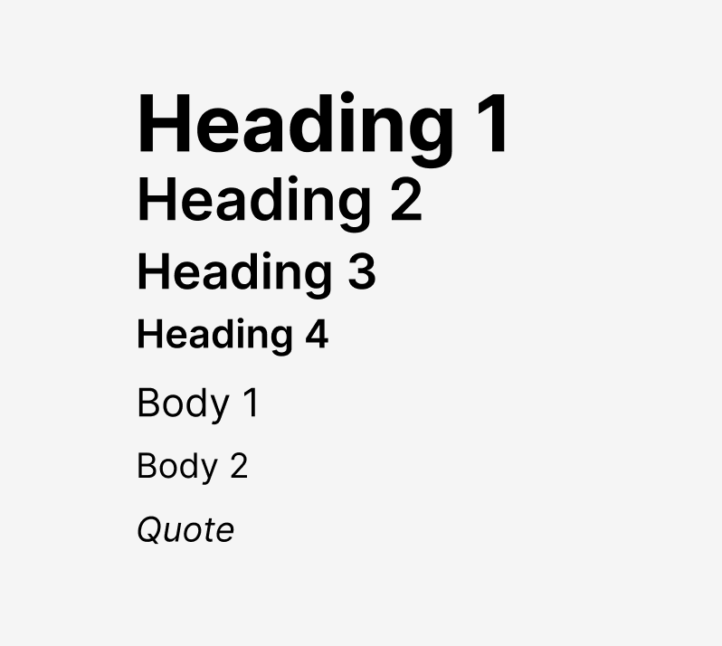

# figma-dev-examples

This repo contains several Figma plugin examples.

They are as simple as possible, showing one concept per example.

To run them, point Figma to the `manifest.json` file in each folder. The plugin will then import locally.

Doing this will only work in the desktop version of Figma.

Almost all examples are straight Javascript and require no compilation step.

<table>
  <thead>
    <tr>
      <th>Image</th>
      <th>Description</th>
    </tr>
  </thead>
  <tbody>
    <tr>
      <td></td>
      <td>viewport-api</td>
    </tr>
    <tr>
      <td></td>
      <td>tutorial-2-text</td>
    </tr>
    <tr>
      <td></td>
      <td>tutorial-1-rectangle</td>
    </tr>
    <tr>
      <td></td>
      <td>render-type-scale</td>
    </tr>
    <tr>
      <td></td>
      <td>notify-api</td>
    </tr>
    <tr>
      <td></td>
      <td>list-item-autolayout</td>
    </tr>
    <tr>
      <td></td>
      <td>list-fonts</td>
    </tr>
    <tr>
      <td></td>
      <td>icon-library</td>
    </tr>
    <tr>
      <td></td>
      <td>basic-group-example</td>
    </tr>
  </tbody>
</table>
